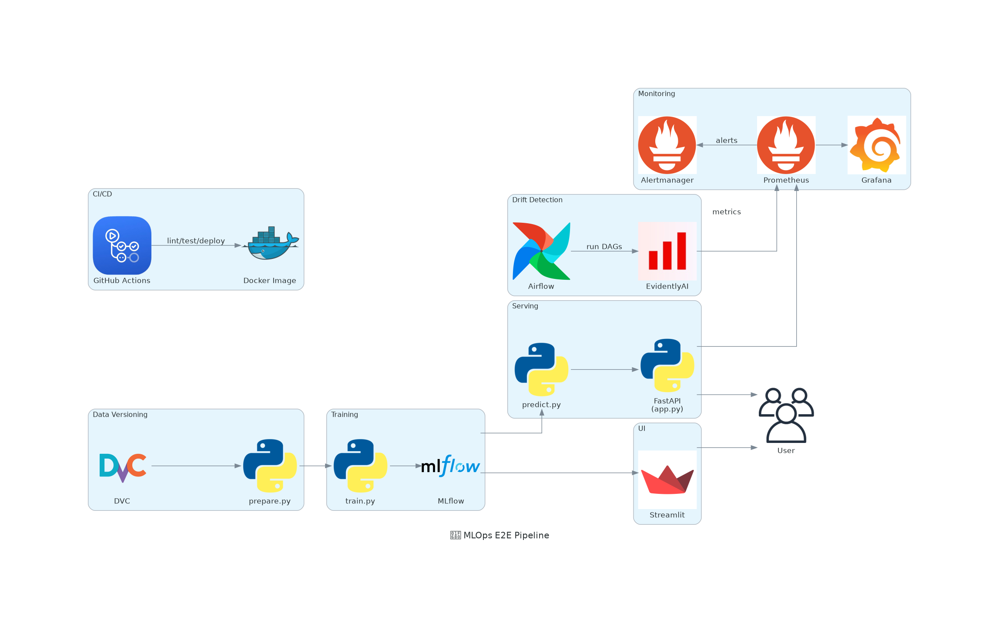

# 🚀 MLOps End-to-End Regression Pipeline

Production-grade MLOps pipeline for regression tasks. Covers data prep, training, deployment, monitoring, and CI/CD—all containerized and cloud-ready.

---

## Architecture Diagram

Below is the autogenerated system architecture diagram:



---

## 📁 Project Structure

```text
(WIP)

---

## Future Plans

| Layer               | Tooling                                     |
| ------------------- | ------------------------------------------- |
| **Modeling**        | `scikit-learn`, `MLflow`                    |
| **API**             | `FastAPI` for real-time inference           |
| **UI**              | `Streamlit` for demos                       |
| **Data Versioning** | `DVC`, `params.yaml`                        |
| **CI/CD**           | `GitHub Actions`, `pytest`, `Docker`        |
| **Monitoring**      | `Prometheus`, `Grafana`, `Alertmanager`     |
| **Drift Detection** | `Airflow`, `EvidentlyAI`                    |
| **Infra as Code**   | `Docker Compose`, `Kubernetes`, `Terraform` |

---
## ▶️ Quickstart

1. **Prerequisites**: Docker, Docker Compose, Python 3.9+
2. **Start all services**:

```bash
docker-compose up --build
```

3. **Access Services**:

| Service      | URL                                                      |
| ------------ | -------------------------------------------------------- |
| MLflow       | [http://localhost:5000](http://localhost:5000)           |
| FastAPI      | [http://localhost:8000/docs](http://localhost:8000/docs) |
| Streamlit    | [http://localhost:8501](http://localhost:8501)           |
| Grafana      | [http://localhost:3000](http://localhost:3000)           |
| Prometheus   | [http://localhost:9090](http://localhost:9090)           |
| cAdvisor     | [http://localhost:8080](http://localhost:8080)           |
| Alertmanager | [http://localhost:9093](http://localhost:9093)           |

> Make sure backend and frontend containers are built before training.

---

## 📈 CI/CD + Monitoring

* GitHub Actions for lint/test/deploy
* Prometheus + Grafana for system metrics
* Airflow DAGs + EvidentlyAI for drift alerts
* Pushgateway for custom metrics

---

## 🧪 Testing

```bash
pytest tests/
```

Tests include:

* Data prep validation
* Training logic
* Inference API (FastAPI)
* UI integrity (Streamlit)

---

## 🗺️ Roadmap

* 🔁 Automated retraining (on drift)
* 🔐 Auth, secrets, RBAC for API/UI
* ☁️ Terraform + Helm for cloud rollout
* 🧠 Feature Store integration
* 🚦 Canary/Blue-Green deployment workflows

---

## 🙌 Credits

Monitoring stack based on [dockprom](https://github.com/stefanprodan/dockprom) by Stefan Prodan (MIT License).

---

## 👤 Author

Personal project by [@shisian512](https://github.com/shisian512).
Fork, scale, and use it for your own MLOps workflow.

```

---

### 🔍 Why This Format?

- **Cognitive load is minimized**: Headers act as anchors, helping readers jump to relevant sections.
- **CI/CD and monitoring visibility**: Many MLOps projects hide these—this makes yours production-aware.
- **Clean quickstart**: New users or teammates can boot the whole system with minimal commands.
- **Feature flexibility**: The roadmap clearly shows extensibility, critical for real-world use.

Let me know if you'd like this adapted for a **multi-page Wiki**, **GitHub Pages site**, or architecture diagram integration.
```